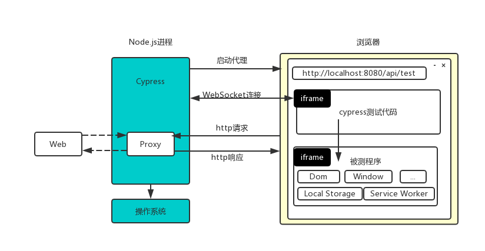

# 为什么需要自动化测试
自动化测试是利用计算机去检查软件是否正常运行的方法，自动化测试一旦被创建，他可以不会吹灰之力的进行无数次重复测试
自动化测试能够预防无意引入的 bug，并鼓励开发者将应用分解为可测试、可维护的函数、模块、类和组件。

在手工测试过程中，我们应该都经历过或者看到过类似的问题：
- 版本发布时需要化好几个小时甚至几天来对我们的应用进行测试，其中老功能的测试占了不少比例
- 应用功能越来越庞大参与人越来越多后，实现一个小的feature或者是改一个BUG，你会变的越来越小心翼翼，总会担心这会不会影响到其他功能
- 代码重构总是伴随着大量的回归测试

通过自动化测试，可以有效帮助团队改善这些问题，让你的团队更快速、自信地构建复杂的应用。

> 注意，并不是所有应用都有这样的特点与对应的问题存在，比如C端的各种活动页面，应用的生命周期短且开发周期也非常短，做自动化就是完全没必要的。

# 测试的类型

以下更多的是从前端的视角来对我们可能进行的自动化测试进行分类

- 单元测试：检查给定函数、类或组合式函数的输入是否产生预期的输出或副作用。
- 组件测试：检查你的组件是否正常挂载和渲染、是否可以与之互动，以及表现是否符合预期。这些测试比单元测试导入了更多的代码，更复杂，需要更多时间来执行。
- UI测试：检查UI界面是否符合预期，往往会通过Mock解决对于后端的依赖。
- 端到端测试：检查跨越多个页面的功能，并对生产构建的应用进行实际的网络请求。这些测试通常涉及到建立一个数据库或其他后端。（广义上的UI测试，也可以认为是端到端测试）

其中最具有性价比的测试类型我们认为是组件测试，在对组件进行测试时对于其他服务基本没有依赖，可以独立进行测试，同时各种公共组件也广泛的使用在我们的系统中的各个地方，通过自动化测试保障好它们的质量对于系统整体的质量提升有这明显的帮助。

# 组件测试的方式

## 白盒测试

白盒测试知晓一个组件的实现细节和依赖关系。它们更专注于将组件进行更独立的测试。这些测试通常会涉及到模拟一些组件的部分子组件，以及设置插件的状态和依赖性。

通常各种开源UI组件库的测试实现(如[ant-design](https://github.com/ant-design/ant-design/blob/master/components/date-picker/__tests__/DatePicker.test.tsx))，就更接近于这里表达的白盒测试类型，他们一般会使用Jest、Vitest这样的测试框架。

## 黑盒测试
黑盒测试不知晓一个组件的实现细节。这些测试尽可能少地模拟，以测试组件在页面中工作的真实情况。如果你的组件包含了多个子组件，比如你的业务里面自己封装了一个树状穿梭框TreeTransfer组件，它包含了一个Tree组件与一个List组件，那我们只会选择对把他们集成起来的TreeTransfer组件进行测试，而不是单独测试Tree与List组件。

如[Playwright](https://playwright.dev/docs/release-notes#version-122)与[Cypress](https://docs.cypress.io/guides/component-testing/writing-your-first-component-test)推出的Components Testing功能，在真实的浏览器中去渲染组件然后对它进行自动化测试，就是组件黑盒测试的体现。

# 推荐的方案

我们更加推荐使用真实的浏览器去渲染我们的组件进行黑盒测试，越接近用户使用方式的测试时是越可信的测试。同时Jest等测试框架通过jsdom去模拟生成Dom的方案也有着很多局限性，比如一些与宽高计算相关的功能测试它们就无法实现

我们选择当前最热门的两个端到端测试框架`Playwright(41.8k Star)`与`Cypress(40.4K)`针对于Components Testing功能去进行对比，他们都能够在真实地浏览器中渲染组件进行组件测试。

# Playwright组件测试案例

## Playwright简介
Playwright是2020年微软推出的一个专门用来做Web应用的测试与自动化的框架，他们够通过同一套API去测试你的Web应用运行在Chromium, Firefox and WebKit浏览器的情况。支持使用Jascript/TypeScript/Java/Python/.NET语言。

与Puppeteer（一个使用NodeJS操作浏览器的库）的关系与差异：

它的开发团队来自于Puppeteer，Puppeteer受到了广泛的欢迎，他们决定把他发扬广大，适用在更多的浏览器上，并且充分借鉴它的优点与踩过的坑，做出大量新的设计，也产成了很多破坏性的变更，于是有了Playwright。

**playwright架构图**

@playwright/test里面实现了测试用例的组织、运行、断言、测试报告生成等功能

@playwright/test中的自动化测试代码会调用到playwright中各种操作浏览器的API

而playwright通过Chrome DevTools Protocol去控制浏览器，使用Websocket进行通信，整个过程中不会出现频繁启动浏览器与建立通信的情况

**BrowserContext**

存在于browser与page之间，每个browser可以创建出多个完全独立的context，context的创建速度快且资源消耗少，每个context可以创建多个page

通过这个设计，我们可以去操作多个session独立的浏览器上下文，同时在每次运行测试时也可以做到只启动一次浏览器，每一个test case都使用一个独立context去进行测试

其他特点：
- 开箱即用
- 良好的TS支持
- 强大、易用的的配套VS Code插件（开发、断点调试、自动录制、单用例执行）
- 良好的可视报告
- 完美的多标签、iframe支持

# Cypress组件测试案例

## Cypress简介
Cypress是基于JavsScript的前端测试工具，可以对浏览器中运行的任何内容进行更快速简单可靠的测试，它可以用来编写所有类型的测试（端到端测试、接口测试、单元测试）。

**Cypress架构图**

Cypress的测试代码与被测试的web应用会直接在同一个浏览器中运行，不需要额外的驱动程序（如WebDriwer），Cypress对于被测试的web应用很强的控制能力。

在浏览器这个级别，Cypress能够直接操作来自web应用的Dom、Window、Local Storage、network等内容。

浏览器之后是一个Nodejs进程，通过它启动浏览器后，与浏览器之间会使用
WebbSocket链接进行通信。同时在这里对于网络请求会进行代理控制，可以做到读取和更改网络请求等操作。

在操作系统级别，Cypress通过NodeJs进程可以做到截图、录制视频、文件读写等操作。

其他特点：
- 支持插件化，社区提供了大量插件
- 自动等待
- 截图、视频
- 开箱即用
- 调试友好

# 实施自动化测试的策略

# 总结

作为最新推出的端到端测试框架，playwright在设计层面的优越性几乎克服了所有的Cypress的一些不足之处