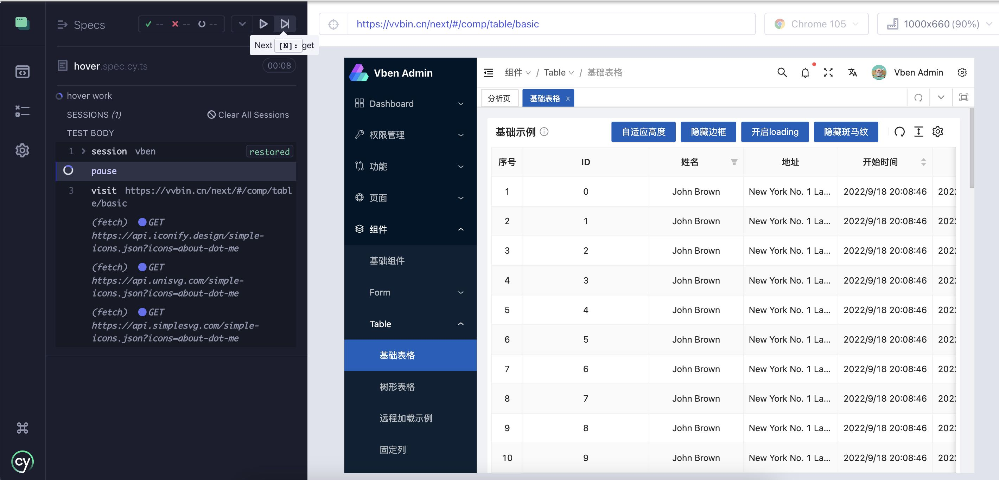
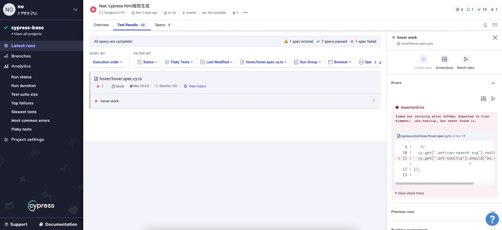
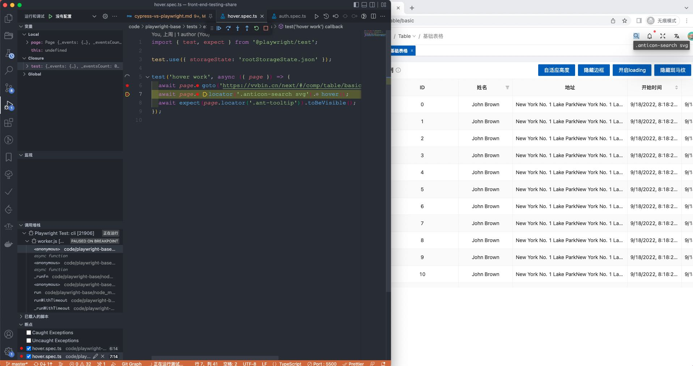
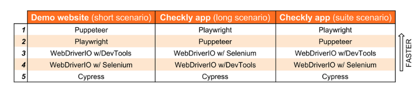
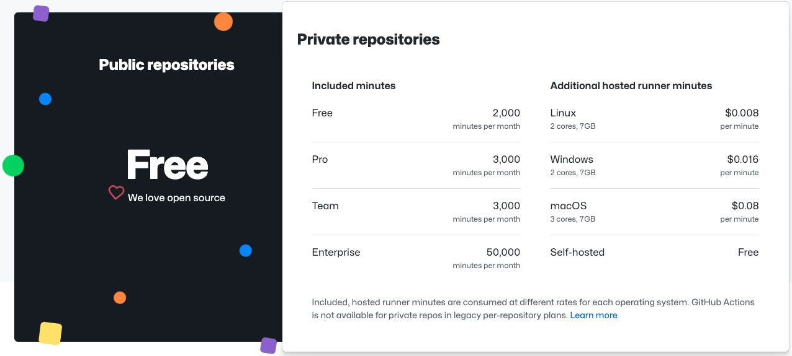
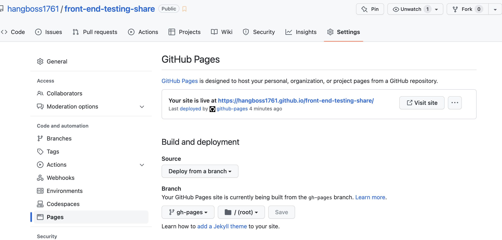
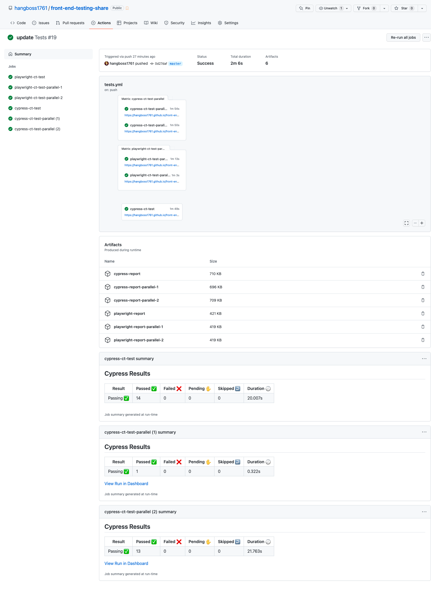

# Playwright VS Cypress

本文将对前端自动化测试领域中最热门的两个测试框架Playwright与Cypress进行详细对比，通过代码片段与实际项目来帮大家直观的感受两个框架在各方面的基本情况。

如果你对于自动化测试还非常陌生，可以先在我们的另一片文章中了解一些背景知识，同时关于两个框架的背景、架构设计也在文中介绍了，这里我们不再重复介绍。

// TODO: 补充组件测试的文章链接

所有的代码可以在<https://github.com/hangboss1761/front-end-testing-share>查看，框架搭建可以直接参考它，后面会直接演示具体代码。推荐将项目clone到本地运行，有演示代码不好理解的话，直接跑对应的代码，在浏览器中观察它是在做什么。

# 基础功能对比

## TypeScript支持

### Cypress

从4.4.0版本开始提供TypeScript支持，配置也非常简单，自身的API有较好的TS类型支持，对于自定义Commands支持度一般，需要自己去写`.d.ts`文件，即使你掌握了基本的ts知识，一开始写起这些声明文件，可能也并不会来的比较顺利

```ts
// code/cypress-base/cypress/types.d.ts
// reference code is written like below to avoid the clash in mocha types.
// in most of the cases, simple <reference types="cypress" /> will do.
/// <reference path="../node_modules/cypress/types/cy-blob-util.d.ts" />
/// <reference path="../node_modules/cypress/types/cy-bluebird.d.ts" />
/// <reference path="../node_modules/cypress/types/cy-minimatch.d.ts" />
/// <reference path="../node_modules/cypress/types/lodash/index.d.ts" />
/// <reference path="../node_modules/cypress/types/sinon/index.d.ts" />
/// <reference path="../node_modules/cypress/types/jquery/index.d.ts" />
/// <reference path="../node_modules/cypress/types/cypress.d.ts" />
/// <reference path="../node_modules/cypress/types/cypress-type-helpers.d.ts" />
/// <reference path="../node_modules/cypress/types/cypress-global-vars.d.ts" />

declare namespace Cypress {
  // add custom Cypress command to the interface Chainable<Subject>
  interface Chainable<Subject = any> {
    // let TS know we have a custom command cy.clickLink(...)
    clickLink(label: string | number | RegExp): void
    /**
     * Custom command to select DOM element by data-cy attribute.
     * @example cy.dataCy('greeting')
     */
    dataCy(value: string): Chainable<JQuery<Element>>
    /**
     * Custom command to type a few random words into input elements
     * @param count=3
     * @example cy.get('input').typeRandomWords()
     */
    typeRandomWords(
      count?: number,
      options?: Partial<TypeOptions>
    ): Chainable<JQuery<Element>>
  }

  // add properties the application adds to its "window" object
  // by adding them to the interface ApplicationWindow
  interface ApplicationWindow {
    // let TS know the application's code will add
    // method window.add with the following signature
    add(a: number, b: number): number
  }
}

```

### Playwright

开箱即用的TS支持，TS开发体验极佳。

## Authentication鉴权

### Cypress

#### 基本用法

可以通过UI或者API获取鉴权信息，[通过API的参考文档](https://docs.cypress.io/api/commands/session#Updating-an-existing-login-custom-command)

```ts
// code/cypress-base/cypress/e2e/authentication/auth.spec.cy.ts
import { userInfo } from '../../fixtures/assets/data';

describe('authentication work', () => {
  beforeEach(() => {
    cy.visit('https://vvbin.cn/next/#/login');
    cy.get('input#form_item_account').clear().type(userInfo.root.name);
    cy.get('input#form_item_password').clear().type(userInfo.root.password);
    cy.get('.ant-form-item').last().click();
    cy.url().should('contain', '/dashboard');
  });

  /**
   * 验证右上角的全局搜索功能
   */
  it('global search work', () => {
    /**
     * Arrange准备：登录鉴权
     * Act执行：
     * 1. 点击搜索图标
     * 2. 输入“组件”
     * Assert断言：断言存在搜索结果且第一个搜索结果中包含“组件”两个字
     */
    cy.get('.vben-layout-header-action .anticon-search').click();
    cy.get('.vben-app-search-modal input[placeholder="搜索"]').type('组件');

    // 断言
    cy.get('.vben-app-search-modal-list li').first().should('include.text', '组件');
  });
});
```

#### 鉴权复用

在多个用例之间复用鉴权操作，并且用例之间仍然保持完全独立的最佳实践。

- 使用`cy.session`抓取页面session并缓存，避免重复登录（10.6.0版本中，该API仍为实验性API,[详情参考](https://docs.cypress.io/api/commands/session)）
- 通过断言去确保信息已被缓存到session，确保开始运行用例时它是可用的状态

```ts
// code/cypress-base/cypress/support/commands.ts
Cypress.Commands.add('login', (username, password) => {
  cy.session(username, () => {
    cy.visit('https://vvbin.cn/next/#/login');

    cy.get('input#form_item_account').clear().type(username);
    cy.get('input#form_item_password').clear().type(password);
    cy.get('.ant-form-item').last().click();

    cy.url().should('contain', '/dashboard')
  });
});

// code/cypress-base/cypress/e2e/authentication/reuseAuth.spec.cy.ts
import { userInfo } from '../../fixtures/assets/data';

beforeEach(() => {
  cy.login(userInfo.root.name, userInfo.root.password);
});

describe('authentication work', () => {
  it('test case 1 reuse authentication', () => {
    cy.visit('https://vvbin.cn/next/#/');
    cy.get('.vben-layout-header-action .anticon-search').click();
    cy.get('.vben-app-search-modal input[placeholder="搜索"]').type('组件');

    cy.get('.vben-app-search-modal-list li').first().should('include.text', '组件');
  });

  it('test case 2 reuse authentication', () => {
    cy.visit('https://vvbin.cn/next/#/');
    cy.get('.vben-layout-header-action .anticon-search').click();
    cy.get('.vben-app-search-modal input[placeholder="搜索"]').type('组件');

    cy.get('.vben-app-search-modal-list li').first().should('include.text', '组件');
  });
});
```

角色切换
- cypress不支持多tab同时运行，所有的切换都会在一个tab下进行

```ts
// code/cypress-base/cypress/e2e/authentication/switchAuth.spec.cy.ts
import { userInfo } from '../../fixtures/assets/data';

it('authentication switch work', () => {
  cy.login(userInfo.root.name, userInfo.root.password);

  cy.visit('https://vvbin.cn/next/#/');
  cy.get('.vben-layout-header-action .anticon-search').click();
  cy.get('.vben-app-search-modal input[placeholder="搜索"]').type('组件');

  cy.get('.vben-app-search-modal-list li').first().should('include.text', '组件');

  // 切换角色
  cy.login(userInfo.normal.name, userInfo.normal.password);
  cy.visit('https://vvbin.cn/next/#/');

  // 断言角色切换成功
  cy.get('.vben-header-user-dropdown__name').should('have.text', 'test user');
});
```

### Playwright

#### 最基本的鉴权处理

可以通过UI或者API获取鉴权信息，[通过API的参考文档](https://playwright.dev/docs/test-auth)

```ts
// code/playwright-base/tests/modules/authentication/auth.spec.ts
import { test, expect } from '@playwright/test';
import { userInfo } from '../../assets/data/index';

test.describe('authentication work', () => {
  test.beforeEach(async ({ page }) => {
    await page.goto('https://vvbin.cn/next/#/login');
    await page.locator('input#form_item_account').fill(userInfo.root.name);
    await page.locator('input#form_item_password').fill(userInfo.root.password);
    await page.locator('.ant-form-item').last().click();
    await page.waitForURL('**/dashboard/**');
  });

  test('global search work', async ({ page }) => {
    await page.locator('.vben-layout-header-action .anticon-search').click();
    await page.locator('.vben-app-search-modal input[placeholder="搜索"]').fill('组件');

    await expect(page.locator('.vben-app-search-modal-list li').first()).toContainText('组件');
  });
});

```

#### 鉴权复用

配置globalSetup，在里面将鉴权信息抓取并保存到本地进行复用。

```ts
// code/playwright-base/tests/global-setup/index.ts
import { chromium } from '@playwright/test';
import { userInfo } from '../assets/data/index';

export const saveStorageState = async ({ name, password }: { name: string; password: string }, path: string) => {
  // 启动一个浏览器,每个浏览器可以构造多个context,独立且session隔离
  const browser = await chromium.launch({ headless: true });
  // 每个browserContext可以拥有多个page
  const context = await browser.newContext({ ignoreHTTPSErrors: true });
  // 标签页
  const page = await context.newPage();

  await page.goto('https://vvbin.cn/next/#/login');
  await page.locator('input#form_item_account').fill(name);
  await page.locator('input#form_item_password').fill(password);
  await page.locator('.ant-form-item').last().click();
  await page.waitForURL('**/dashboard/**');

  await page.context().storageState({ path });

  await browser.close();
};

export default async function globalSetup() {
  try {
    await saveStorageState(userInfo.root, 'rootStorageState.json');
    await saveStorageState(userInfo.normal, 'normalStorageState.json');
  } catch (error) {
    console.log(error);
    process.exit(1);
  }
}
```

```ts
// code/playwright-base/tests/modules/authentication/reuseAuth.spec.ts
import { test, expect } from '@playwright/test';

// 复用登录状态
test.use({ storageState: 'rootStorageState.json' });

test.describe('authentication work', () => {
  test('test case 1 reuse authentication', async ({ page }) => {
    await page.goto('https://vvbin.cn/next/#/');
    await page.locator('.vben-layout-header-action .anticon-search').click();
    await page.locator('.vben-app-search-modal input[placeholder="搜索"]').fill('组件');

    await expect(page.locator('.vben-app-search-modal-list li').first()).toContainText('组件');
  });

  test('test case 2 reuse authentication', async ({ page }) => {
    await page.goto('https://vvbin.cn/next/#/');
    await page.locator('.vben-layout-header-action .anticon-search').click();
    await page.locator('.vben-app-search-modal input[placeholder="搜索"]').fill('组件');

    await expect(page.locator('.vben-app-search-modal-list li').first()).toContainText('组件');
  });
});

```

#### 角色切换

可以在一个用例中，打开多个窗口进行不同角色账号的相关操作，而且互不影响

```ts
// code/playwright-base/tests/modules/authentication/switchAuth.spec.ts
import { test, expect } from '@playwright/test';

test.describe('authentication switch between test', () => {
  test.describe(() => {
    test.use({ storageState: 'rootStorageState.json' });
    test('global search work', async ({ page }) => {
      await page.goto('https://vvbin.cn/next/#/');
      await page.locator('.vben-layout-header-action .anticon-search').click();
      await page.locator('.vben-app-search-modal input[placeholder="搜索"]').fill('组件');

      await expect(page.locator('.vben-app-search-modal-list li').first()).toContainText('组件');
    });
  });

  test.describe(() => {
    test.use({ storageState: 'normalStorageState.json' });
    test('role switch success', async ({ page }) => {
      await page.goto('https://vvbin.cn/next/#/');
      await expect(page.locator('.vben-header-user-dropdown__name')).toHaveText('test user');
    });
  });
});

test('authentication switch in test', async ({ browser }) => {
  // root账号相关的操作与断言
  const rootContext = await browser.newContext({ storageState: 'rootStorageState.json' });
  const rootPage = await rootContext.newPage();

  await rootPage.goto('https://vvbin.cn/next/#/');
  await rootPage.locator('.vben-layout-header-action .anticon-search').click();
  await rootPage.locator('.vben-app-search-modal input[placeholder="搜索"]').fill('组件');

  await expect(rootPage.locator('.vben-app-search-modal-list li').first()).toContainText('组件');

  // 普通账号相关的操作与断言
  const normalContext = await browser.newContext({ storageState: 'normalStorageState.json' });
  const normalPage = await normalContext.newPage();

  await normalPage.goto('https://vvbin.cn/next/#/');
  await expect(normalPage.locator('.vben-header-user-dropdown__name')).toHaveText('test user');
});

```

## Hover事件支持

### Cypress

事件触发是模拟的，意味着`cy.click` `cy.type`等都是通过js实现的，并且不支持Hover事件

通过社区提供的[cypress-real-events](https://github.com/dmtrKovalenko/cypress-real-events)（使用CDP协议）可以才能实现出真实事件操作

```ts
// code/cypress-base/cypress/e2e/hover/hover.spec.cy.ts
import { userInfo } from '../../fixtures/assets/data/index';
it('hover work', () => {
  cy.login(userInfo.root.name, userInfo.root.password);
  cy.visit('https://vvbin.cn/next/#/comp/table/basic');
  /**
   * 不支持hover,https://docs.cypress.io/api/commands/hover
   * 如果hover是通过JS的事件实现，类似mouseover，可以通过trigger('mouseover')来触发
   * 如过不是，可以借助社区提供的https://github.com/dmtrKovalenko/cypress-real-events这个库实现real hover
   */
  cy.get('.anticon-search svg').realHover();
  cy.get('.ant-tooltip').should('be.visible');
});

```

### Playwright

完美支持

```ts
// code/playwright-base/tests/modules/hover/hover.spec.ts
import { test, expect } from '@playwright/test';

test.use({ storageState: 'rootStorageState.json' });

test('hover work', async ({ page }) => {
  await page.goto('https://vvbin.cn/next/#/comp/table/basic');
  await page.locator('.anticon-search svg').hover();
  await expect(page.locator('.ant-tooltip')).toBeVisible();
});
```

## 拖拽

### Cypress

满足基本的拖拽需求

```ts
// code/cypress-base/cypress/e2e/drag/drag.spec.cy.ts
import { userInfo } from '../../fixtures/assets/data/index';
it('drag work', () => {
  cy.login(userInfo.root.name, userInfo.root.password);

  cy.visit('https://vvbin.cn/next/#/dashboard/analysis');
  cy.get('.vben-menu-item').contains('工作台').click();

  cy.get('.ant-tabs-tab')
    .first()
    .trigger('mousedown')
    .trigger('mousemove', { clientX: 200 })
    .trigger('mouseup', { force: true });
});

```

### Playwright

拖拽相关API比较丰富，如`dispatchEvent`、`locator.dragTo(target[, options])`、`page.dragAndDrop(source, target[, options])`

```ts
// code/playwright-base/tests/modules/drag/drag.spec.ts
import { test, expect } from '@playwright/test';

test.use({ storageState: 'rootStorageState.json' });

test('drag work', async ({ page }) => {
  await page.goto('https://vvbin.cn/next/#/comp/modal');
  await page.locator('.ant-btn:has-text("打开弹窗1")').click();

  const target = page.locator('.ant-modal .ant-modal-header');
  await target.dispatchEvent('mousedown');
  await target.dispatchEvent('mousemove', { clientX: 800 });
  await target.dispatchEvent('mousedup');

  await page.goto('https://vvbin.cn/next/#/flow/flowChart');
  const conditionNode = page.locator('.lf-dnd-item').nth(4);
  const canvasArea = page.locator('.lf-drag-able').first();
  await conditionNode.dragTo(canvasArea);

  await expect(page.locator('.lf-node-content:has-text("条件判断")')).toBeVisible();
});
```

## 文件上传、下载

### Cypress

官网上暂时没有读到上传相关的文档说明，不过可以通过`cypress-file-uploadl`这个库来实现上传，如果你要测试的上传功能实现时`<input type="file />`不存在或者在后期动态创建，那么可能你没有办法通过它来实现上传文件了
```ts
// code/cypress-base/cypress/e2e/downloadAndUpload/downAndUp.spec.cy.ts
import { userInfo } from '../../fixtures/assets/data/index';
import * as path from 'path';

it('download work', () => {
  cy.login(userInfo.root.name, userInfo.root.password);

  // 下载的文件在下次运行时会清除，可以不用额外remove
  const downloadsFolder = Cypress.config('downloadsFolder');
  const downloadedFilename = path.join(downloadsFolder, 'testName.txt');

  cy.visit('https://vvbin.cn/next/#/feat/download');
  cy.get('.ant-btn').contains('文件流下载').click();

  cy.readFile(downloadedFilename).should('contain', 'text content');
});

it('upload work', () => {
  cy.login(userInfo.root.name, userInfo.root.password);
  const filePath = 'assets/file-upload/upload_template.xlsx';

  cy.visit('https://vvbin.cn/next/#/feat/excel/importExcel');
  cy.get('[type="file"]').attachFile(filePath);

  cy.get('.ant-table-title').should('contain.text', 'upload_template.xlsx');
});

```

### Playwright

提供`setInputFiles`、`waitForEvent('filechooser')`，可以灵活的选择上传方式
```ts
// code/playwright-base/tests/modules/downloadAndUpload/downAndUp.spec.ts
import { test, expect } from '@playwright/test';
import * as fs from 'fs/promises';
import * as path from 'path';
import { remove } from 'fs-extra';

test.use({ storageState: 'rootStorageState.json' });

test('download work', async ({ page }) => {
  await page.goto('https://vvbin.cn/next/#/feat/download');

  const [download] = await Promise.all([
    // It is important to call waitForEvent before click to set up waiting.
    page.waitForEvent('download'),
    page.locator('.ant-btn:has-text("文件流下载")').click(),
  ]);
  const filePath = path.join(__dirname, '../../assets/file-download/text.txt');
  await download.saveAs(filePath);

  expect(await fs.readFile(filePath, { encoding: 'utf-8' })).toContain('text content');
  await remove(filePath);
});

test('upload work', async ({ page }) => {
  await page.goto('https://vvbin.cn/next/#/feat/excel/importExcel');

  const [fileChooser] = await Promise.all([
    // It is important to call waitForEvent before click to set up waiting.
    page.waitForEvent('filechooser'),
    page.locator('.ant-btn:has-text("导入Excel")').click(),
  ]);

  const filePath = path.join(__dirname, '../../assets/file-upload/upload_template.xlsx');

  await fileChooser.setFiles(filePath);

  await expect(page.locator('.ant-table-title:has-text("upload_template.xlsx")')).toBeVisible();
});

```

## iframe支持

### Cypress

支持，但是API易用性一般

```ts
// code/cypress-base/cypress/e2e/iframe/iframe.spec.cy.ts
const getIframeBody = () => {
  return (
    cy
      .get('iframe[data-cy="the-frame"]')
      // Cypress yields jQuery element, which has the real
      // DOM element under property "0".
      // From the real DOM iframe element we can get
      // the "document" element, it is stored in "contentDocument" property
      // Cypress "its" command can access deep properties using dot notation
      // https://on.cypress.io/its
      .its('0.contentDocument.body')
      .should('not.be.empty')
      .then(cy.wrap)
  );
};

it('iframe work', () => {
  cy.visit('cypress/fixtures/iframe_demo.html');

  const iframeBody = getIframeBody();
  iframeBody.find('#sb_form_q').type('百度');
});

```

### Playwright

iframe相关的API基本与普通页面一致，使用简单且功能不受限。

```ts
// code/playwright-base/tests/modules/iframe/iframe.spec.ts
import { test, expect } from '@playwright/test';

test.use({ storageState: 'rootStorageState.json' });

test('iframe work', async ({ page }) => {
  await page.goto('https://vvbin.cn/next/#/frame/doc');

  const frame = page.frameLocator('.vben-iframe-page__main');

  await frame.locator('a:has-text("快速开始")').click();
  await expect(frame.locator('.sidebar-link-item:has-text("介绍")')).toBeVisible();
});


```

## 多Tab支持

### Cypress

受限于Cypress运行在浏览器中的设计，它不支持多个Tab同时运行，[这里](https://docs.cypress.io/guides/references/trade-offs#Multiple-tabs)有一些曲线救国的实现方式，但是也非常有局限性

```ts
// code/cypress-base/cypress/e2e/multi-tabs/multiTabs.spec.cy.ts
import { userInfo } from '../../fixtures/assets/data/index';
/**
 * 无法实现对应的功能
 */
it.skip('multiple tabs works', () => {
  cy.login(userInfo.root.name, userInfo.root.password);
  cy.visit('https://vvbin.cn/next/#/dashboard/analysis');
  // https://docs.cypress.io/guides/references/trade-offs#Multiple-tabs
  cy.get('.vben-menu-submenu-title').contains('外部页面').click();

  cy.get('.vben-menu-item').contains('项目文档(外链)').click();
  // 对于新打开的tab页，没有操作能力
});

```

### Playwright

完美支持，能够通过多种方式监听新窗口、新tab页面打开，并且对打开后的页面具有完整地操作能力。

```ts
// code/playwright-base/tests/modules/multi-tabs/multiTabs.spec.ts
import { test, expect } from '@playwright/test';

test.use({ storageState: 'rootStorageState.json' });

test('multiple tabs works', async ({ page }) => {
  await page.goto('https://vvbin.cn/next/#/dashboard/analysis');
  await page.locator('.vben-menu-submenu-title:has-text("外部页面")').click();

  const [popup] = await Promise.all([
    // It is important to call waitForEvent before click to set up waiting.
    page.waitForEvent('popup'),
    // Opens popup.
    page.locator('.vben-menu-item:has-text("项目文档(外链)")').click(),
  ]);

  await popup.waitForLoadState();
  const title = await popup.title();
  expect(title).toBe('Home | Vben Admin');
});

```

## 网络请求

### Cypress

支持拦截请求前后，发起请求
```ts
cy.intercept({
  method: 'POST',
  url: '/myApi',
}).as('apiCheck')

cy.visit('/')
cy.wait('@apiCheck').then((interception) => {
  assert.isNotNull(interception.response.body, '1st API call has data')
})

cy.wait('@apiCheck').then((interception) => {
  assert.isNotNull(interception.response.body, '2nd API call has data')
})

cy.wait('@apiCheck').then((interception) => {
  assert.isNotNull(interception.response.body, '3rd API call has data')
})
```

### Playwright

支持拦截并修改请求、代理请求、发起请求，可以比较准确的控制监听哪一个操作后触发的请求

```ts

const [request] = await Promise.all([
  // Waits for the next response with the specified url
  page.waitForResponse('https://example.com/resource'),
  // Triggers the response
  page.click('button.triggers-response'),
]);

const [response] = await Promise.all([
  page.waitForResponse('**/api/fetch_data'),
  page.locator('button#update').click(),
]);

```

---

# 断言

## Cypress

内部捆绑了`Chai`这个断言库，主要的风格如下，提供[automatically retry](https://docs.cypress.io/guides/core-concepts/introduction-to-cypress#Assertions)。

```ts
cy.get('li.selected').should('have.length', 3)
cy.get('form').find('input').should('not.have.class', 'disabled')
cy.get('li.hidden').should('not.be.visible')
cy.get('[data-testid="loading"]').should('not.exist')
```

## Playwright

使用了jest的`expect`，并且自己也提供了一些特有的断言方法。并且提供了[re-testing](https://playwright.dev/docs/test-assertions)的特性。

```ts
expect(success).toBeTruthy();

await expect(page.locator('.status')).toHaveText('Submitted');
```

[automatically retry](https://docs.cypress.io/guides/core-concepts/introduction-to-cypress#Assertions)与[re-testing](https://playwright.dev/docs/test-assertions)类似，已re-testing为例，Playwright会re-testing Node直到它内部存在文本”Submitted“，在这个过程中它会一遍又一遍的去抓取Node并做检查，存在一个超时时间。

# 报告与调试

## Cypress

- 官方不提供报告，通过社区提供的插件来
- 通过查看video与页面快照进行调试
- 在`cypress open` mode中调试，可以断点、单步运行、在控制台查看日志

- 对于运行在CI中的用例调试，如果没有dashboard服务，只能通过观察视频、与页面快照进行调试，或者在本地复现问题问题本地调试


## Playwright

- 通过查看video与[trace](https://playwright.dev/docs/trace-viewer)进行调试，在trace中可以看到action的日志、快照、网络请求、浏览器控制台信息，对于调试帮助非常大，特别是定位运行在CI中用例的问题。

- 在VS Code中使用[Playwright Test for VSCode](https://playwright.dev/docs/getting-started-vscode)进行调试，与在VS Code中调试Web应用的体验基本一致

- 对于运行在CI中的用例调试，可以通过video与trace进行调试

# 语法对比

Playwright更接近于现代JavaScript & TypeScript的语法风格，可以任意选择面向对象或者函数式的编码风格。

Cypress更接近于JQuery的语法风格，大量的链式调用以及全局命令注入。

# 并发执行支持

Playwright在并发执行方面的支持度非常好，可以在相同与不同文件之间的用例并发执行，甚至还可以并发执行在多种浏览器中，使用起来也非常方便。

```bash
# 单个机器中的并发执行
npx playwright test --workers 4

# 多个机器中的并发执行
npx playwright test --shard=1/3
npx playwright test --shard=2/3
npx playwright test --shard=3/3
```

Cypress官方没有提供在在单个机器中使用多个浏览器并发运行用例的能力，不过我们可以通过社区提供的插件[cypress-parallel](https://github.com/tnicola/cypress-parallel)插件做到。官方提供的了多个机器中并发执行的能力，但是需要配合Cypress Dashboard服务；单个文件内用例也无法做到并发执行，必须拆分到多个文件。

> 单个机器中的并发执行，并不总是并发的数量越多，整体运行速度就越快，还要看你的机器性能，如果性能一般，设置的并发数又很多，可能会导致内存暂用过多，机器变得非常卡慢，并行后的整体运行速度范围变慢了。

# 开源支持

## 收费

Playwright开源且完全免费。

Cypress开源免费，但是DashBoard服务免费版有功能与使用数量上的限制，且无法私有化部署。


## 社区生态

Cypress有良好的插件生态，很多官方没有提供的功能，能都有对应的插件能够实现。官方文档中很多功能的也直接推荐使用对应的插件插件实现。但不幸的是随着Cypress不断地迭代，一些插件可能没有得到及时的维护导致在新版本的Cypress中无法使用或者功能有缺陷，其中不乏一些官方文档中推荐使用的插件。

Playwright没有对应的插件生态，但是基本上各种你需要的各种能力官方都提供了，并且有稳定可靠的质量保证。

Cypress历史更悠久，对于使用过程中遇到的问题，可能你在网上都能搜索到相关的答案，并且国内相关的文章与教程也比较多。

Playwright作为2021年新推出的测试框架，在中文资料的丰富度上远不如Cypress，遇到问题时更多的需要你去查阅官方issue、通过英文关键字在stackoverflow/google上搜索问题，也可以去官方仓库提issue，官方会在48h内进行回复。但是，Playwright自身的文档做的非常出色，通过仔细阅读官方文档可能你的很多问题就能得到解决。


# 插件

Playwright暂时没有提供对应的插件支持，但是你需要的东西可能在官方都得到了较好的支持，不再需要额外的插件支持。

Cypress在社区中有大量的插件，免费、收费的都有，一些Cypress自身支持有限的功能，很多我们都能通过引入插件支持，比如文件上传下载、hover、多tab、视觉对比，但是要尽量减少这些依赖，因为你所依赖的插件很有可能是缺少维护的状态，很有可能在Cypress升级后插件就没法正常工作了。(官方文档中推荐的视觉对比插件[cypress-plugin-snapshots](https://github.com/meinaart/cypress-plugin-snapshots/issues/215)在升级到Cypress10.x版本后就出现了报错无法使用的问题，且没有人维护)

# 执行速度

来自[cheekly](https://blog.checklyhq.com/cypress-vs-selenium-vs-playwright-vs-puppeteer-speed-comparison/)对比结论，该结论排除并发执行、视频、快照等影响因素，纯粹的去对比相同的用例在不同框架之间的执行速度



- playwright具有最快的执行速度
- Cypress的启动时间更长，整体时间受这个因素影响较大
- Cypress更推荐[在本地环境中运行你要测试的程序](https://docs.cypress.io/guides/end-to-end-testing/testing-your-app#Step-1-Start-your-server)，虽然您当然可以测试已经部署的应用程序，但这并不是 Cypress 的真正优势。
- playwright在测试生产环境的应用时，有明显的速度优势。

**并发执行提高速度**

playwright可以在单个文件、多个文件、同一个机器、不同机器、不同浏览器都可以做到并发执行，官方提供简单的配置让你灵活的选择你想要的并发模式

单个机器上的并发执行
```ts
// playwright.config.ts
import type { PlaywrightTestConfig } from '@playwright/test';

const config: PlaywrightTestConfig = {
  // Limit the number of workers on CI, use default locally
  workers: process.env.CI ? 2 : undefined,
};
export default config;
```

多个机器上的并发执行
```bash
# 机器1
npx playwright test --shard=1/3
# 机器2
npx playwright test --shard=2/3
# 机器3
npx playwright test --shard=3/3
```

Cypres官方并不推荐你在一台机器上去并发执行用例，这，表示这可能会耗费过多的资源需要你的机器有比较可靠的性能([原文在这](https://docs.cypress.io/guides/guides/parallelization#Overview))


在下面的持续集成部分，我们将演示如何在持续集成中做到多机器并发执行

## 持续集成

[Github Action](https://github.com/features/actions)是Github推出的一款简单易用的软件工作流自动化服务，对于托管在Github上的Public repositories完全免费，Private repositories免费使用但限制存储空间与运行时间。



这里我们将会展示怎么使用Github Actions进行持续集成，以及如何使用[GitHub Pages](https://docs.github.com/en/pages)来展示HTML报告。

### Github Pages配置

在仓库中新建分支`gh-pages`，分支的根目录下需要包含一个`index.html`文件

参考：

```html
<!DOCTYPE html>
<html lang="en">
<head>
  <meta charset="UTF-8">
  <meta http-equiv="X-UA-Compatible" content="IE=edge">
  <meta name="viewport" content="width=device-width, initial-scale=1.0">
  <title>Document</title>
</head>
<body>
  root page
</body>
</html>
```

按图中的配置进行设置，开启Github Pages。


完成配置后点击Visit site，在打开的页面中将会出现文案“root page”

这里提供一些预览：
[一个成功运行的workflow](https://github.com/hangboss1761/front-end-testing-share/actions/runs/3075919449)
[Github Page中的Cypress测试报告](https://hangboss1761.github.io/front-end-testing-share/static-pages/cypress-report-ct/)
[Github Page中的Playwright测试报告](https://hangboss1761.github.io/front-end-testing-share/static-pages/playwright-report-ct/)



### Cypress

#### 基本使用

这里将会使用到Cypress官方提供的docker镜像与`cypress-io/github-action`，可以大大减少配置工作。

使用`JamesIves/github-pages-deploy-action`将生成的html报告提交到我们随仓库一起创建好的Github Pages中。

使用`actions/upload-artifact`将测试生成的报告、视频、截图等进行归档。

```yml
# .github/workflows/tests.yml
name: Tests
on:
  push:
    branches: [main, master]
  pull_request:
    branches: [main, master]
  schedule:
    # 定时计划：At 00:00 on Sunday
    - cron: '0 0 * * 0'
jobs:
  cypress-ct-test:
    defaults:
      run:
        shell: bash
        working-directory: code/cypress-base
    timeout-minutes: 60
    runs-on: ubuntu-latest
    container: cypress/browsers:node16.14.2-slim-chrome100-ff99-edge
    environment:
      name: cypress-ct
      url: https://hangboss1761.github.io/front-end-testing-share/static-pages/cypress-report-ct
    steps:
      - name: Checkout
        uses: actions/checkout@v2
      # Install NPM dependencies, cache them correctly
      # and run all Cypress tests
      - name: Cypress run
        uses: cypress-io/github-action@v4 # use the explicit version number
        with:
          component: true
          working-directory: code/cypress-base
      # run github-pages-deploy-action@v4 in docker container need to install
      - name: Install rsync 📚
        run: |
          apt-get update && apt-get install -y rsync
      - name: Deploy
        uses: JamesIves/github-pages-deploy-action@v4
        if: always()
        with:
          force: false
          folder: code/cypress-base/cypress/reports/html/
          target-folder: static-pages/cypress-report-ct/
      - uses: actions/upload-artifact@v2
        if: always()
        with:
          name: cypress-report
          path: |
            code/cypress-base/cypress/reports/
            code/cypress-base/cypress/videos/
          retention-days: 30
```

#### 并发执行

Cypress官方提供的并发执行需要配合[Cypress dashboard](https://docs.cypress.io/guides/dashboard/introduction)使用，dashboard免费版的功能受限且无法私有化部署

官方提供的并发功能中，并发执行时用例的拆分策略无法控制，具体策略参考这个[文档](https://docs.cypress.io/guides/guides/parallelization#Balance-strategy)，当你的用例过少也使用并发执行的话，可能所有的用例都会被分配到一个机器中执行了。

官方对此的答复：<https://github.com/cypress-io/cypress/issues/2520> （暂时不提供其他官方支持，通过付费您可以得到更好的使用体验）

这里有一些不依赖dashboard的解决方案：

- [Cypress Parallelisation Without Cypress Dashboard](https://stackoverflow.com/questions/61973532/cypress-parallelisation-without-cypress-dashboard)
- [sorry-cypress](https://github.com/sorry-cypress/sorry-cypress)，类似Cypress dashboard的服务，开源免费支持测试报告、并发执行、私有部署等。它的升级版<https://currents.dev/>收费。

这里提供的例子使用了用官方的Dashboard

```yml
jobs:
  cypress-ct-test-parallel:
    defaults:
      run:
        shell: bash
        working-directory: code/cypress-base
    timeout-minutes: 60
    runs-on: ubuntu-latest
    container: cypress/browsers:node16.14.2-slim-chrome100-ff99-edge
    strategy:
      fail-fast: false
      matrix:
        # run copies of the current job in parallel
        containers: [1, 2]
    environment:
      name: cypress-ct-parallel-${{ matrix.containers }}
      url: https://hangboss1761.github.io/front-end-testing-share/static-pages/cypress-report-ct-parallel-${{ matrix.containers }}
    steps:
      - name: Checkout
        uses: actions/checkout@v2
      # Install NPM dependencies, cache them correctly
      # and run all Cypress tests
      - name: Cypress run
        uses: cypress-io/github-action@v4 # use the explicit version number
        with:
          component: true
          parallel: true
          browser: chrome
          record: true
          group: 'Cypress - parallel'
          working-directory: code/cypress-base
        env:
          # CYPRESS_RECORD_KEY需要在https://dashboard.cypress.io/创建，并写入到仓库-Settings-Secrets-Actions中
          CYPRESS_RECORD_KEY: ${{ secrets.CYPRESS_RECORD_KEY }}
          # Recommended: pass the GitHub token lets this action correctly
          # determine the unique run id necessary to re-run the checks
          # GITHUB_TOKEN为github action自动生成
          GITHUB_TOKEN: ${{ secrets.GITHUB_TOKEN }}
      # run github-pages-deploy-action@v4 in docker container need to install
      - name: Install rsync 📚
        run: |
          apt-get update && apt-get install -y rsync
      - name: Deploy
        uses: JamesIves/github-pages-deploy-action@v4
        if: always()
        with:
          force: ${{ secrets.GITHUB_TOKEN }}
          folder: code/cypress-base/cypress/reports/html/
          target-folder: static-pages/cypress-report-ct-parallel-${{ matrix.containers }}/
      - uses: actions/upload-artifact@v2
        if: always()
        with:
          name: cypress-report-parallel-${{ matrix.containers }}
          path: |
            code/cypress-base/cypress/reports/
            code/cypress-base/cypress/videos/
          retention-days: 30
```

### Playwright

#### 基本使用

```yml
jobs:
  playwright-ct-test:
    defaults:
      run:
        shell: bash
        working-directory: code/playwright-base
    timeout-minutes: 60
    runs-on: ubuntu-latest
    environment:
      name: playwright-ct
      # 访问该地址可以查看对应的html报告
      url: https://hangboss1761.github.io/front-end-testing-share/static-pages/playwright-report-ct
    container:
      image: mcr.microsoft.com/playwright:v1.25.0-focal
    steps:
      # 拉取代码
      - uses: actions/checkout@v2
      - uses: actions/setup-node@v2
        with:
          node-version: '16.x'
      - name: Install dependencies
        run: yarn install --pure-lockfile
      - name: Run your tests
        run: yarn ct-test
      # run github-pages-deploy-action@v4 in docker container need to install
      - name: Install rsync 📚
        run: |
          apt-get update && apt-get install -y rsync
      # HTML报告部署到github page
      - name: Deploy
        uses: JamesIves/github-pages-deploy-action@v4
        if: always()
        with:
          force: false
          folder: code/playwright-base/playwright-report-ct/
          target-folder: static-pages/playwright-report-ct/
      # 上传制品，保存30天
      - uses: actions/upload-artifact@v2
        if: always()
        with:
          name: playwright-report
          path: code/playwright-base/playwright-report-ct/
          retention-days: 30
```

#### 并发执行

```yml
  playwright-ct-test-parallel:
    defaults:
      run:
        shell: bash
        working-directory: code/playwright-base
    name: 'playwright-ct-test-parallel-${{ matrix.shardIndex }}'
    timeout-minutes: 60
    runs-on: ubuntu-latest
    environment:
      name: playwright-ct-test-parallel-${{ matrix.shardIndex }}
      url: https://hangboss1761.github.io/front-end-testing-share/static-pages/playwright-report-ct-${{ matrix.shardIndex }}
    container:
      image: mcr.microsoft.com/playwright:v1.25.0-focal
    # 通过matrix strategies去定义变量，这将会生成多个相似的job（）
    # 并把matrix中的变量进行组合后,这里将会生成两个组合，对应两个job:（[shardIndex: 1, shardTotal: 2]、[shardIndex: 2,shardTotal: 2]）
    strategy:
      fail-fast: false
      matrix:
        shardIndex: [1, 2]
        shardTotal: [2]
    steps:
      - uses: actions/checkout@v2
      - uses: actions/setup-node@v2
        with:
          node-version: '16.x'
      - name: Install dependencies
        run: yarn install --pure-lockfile
      - name: Run your tests
        run: npx playwright test -c playwright-ct.config.ts --shard=${{ matrix.shardIndex }}/${{ matrix.shardTotal }}
      # run github-pages-deploy-action@v4 in docker container need to install
      - name: Install rsync 📚
        run: |
          apt-get update && apt-get install -y rsync
      - name: Deploy
        uses: JamesIves/github-pages-deploy-action@v4
        if: always()
        with:
          force: false
          folder: code/playwright-base/playwright-report-ct/
          target-folder: static-pages/playwright-report-ct-${{ matrix.shardIndex }}/
      - uses: actions/upload-artifact@v2
        if: always()
        with:
          name: playwright-report-parallel-${{ matrix.shardIndex }}
          path: code/playwright-base/playwright-report-ct/
          retention-days: 30
```


## 测试报告

## 组件测试

### playwright组件测试
#### 组件测试的初始化
在`playwright/index.ts`中可以进行一些初始化操作，比如全局注册组件、引入配置样式等
```ts
// vue2/3 setup demo
```

#### 组件测试

## 其他问题

### Cypress中`cy.visit()`方法的缺陷

`cy.visit()`方法需要等待页面`load`事件触发才算完成，且不可配置。如果页面的资源比较多且部分资源加载比较慢，`load`事件迟迟不触发，只能延长`cy.visit()`的超时时间等待事件触发，可能会严重影响用例执行速度([相关issue](https://github.com/cypress-io/cypress/issues/440))；在playwright中类似的方法为`page.goto()`，可以灵活的配置监听`"load"|"domcontentloaded"|"networkidle"|"commit"`事件（[配置说明](https://playwright.dev/docs/api/class-page#page-goto)），则不会存在这样的问题

## 总结

很多Cypress对比Playwright的视频或者文章中最后的总结环节都提到了，Cypress有非常好的社区成熟度与插件体系，是一个非常成熟的工具，同时如果您愿意付费那么他们提供的付费工具与服务可以非常好的为企业解决他们无法解决的问题或者及时的提供帮助，那么Cypress是你最好的选择；Playwright是一个非常优秀的测试框架它有着光明的未来，但是它还比较新，社区支持还比较少，如果你有一定的自动化测试的经验，可以去选择Playwright去拥抱未来。

---
以下是个人观点，仅供参考

截止到目前的时间2022-09-14，playwright最新发布的版本为1.26.0。

在2022.5.13发布的1.22.0版本中，playwright提供了Component Testing的支持，截止到该版本，playwright对比cypress在功能上基本就没有大的差距了,整体的功能与易用性的优势体现明显。

从官方的的[Releases](https://github.com/microsoft/playwright/releases?page=1)记录中可以看到，Playwright团队保持着每个月一个次版本发布,2-4次左右的补丁版本发布，issue基本上在48h内会进行回复，近半年来除了Component Testing没有其他比较重要的功能发布，更多的是易用性改进与bug修复。项目已经处于相对稳定，且维护积极的状态。

在我们内部项目的实践中，受益于Playwright自身的强大的功能，在技术方面我们基本没有出现过多的难以解决的障碍，官方提供的VS Code插件以及可视报告中的视频回放与[Trace Viewer](https://playwright.dev/docs/trace-viewer-intro)让我们在调试并分析本地与CI中失败用例的成本都降到最低，让我们有更多的时间去解决端到端自动化中的其他问题与障碍。

从对比与实践来看，当前阶段选择Playwright作为团队的测试框架已经不在属于冒险的尝试，而是非常正确的选择，将会为团队的端到端测试与组件测试的顺利开展做出非常重要的铺垫作用。

1.20.0 3-15
1.20.1 3-24
1.20.2 4-2
1.21.0 4-12
1.21.1 4-19
1.22.0 5-13
1.22.1 5-17
1.22.2 5.21
1.23.0 6.28
1.23.1 7-1
1.23.2 7-8
1.23.3 7-13
1.23.4 7-16
1.24.0 7-22
1.24.1 7-22
1.24.2 7-30
1.25.0 8-11
1.25.1 8-23
1.25.2 9-7

