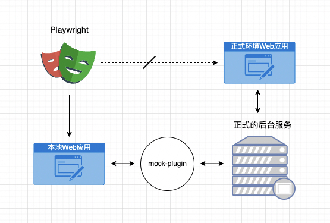

# 端到端测试（待完善）

## 痛点

测试：

- 版本发布时需要花好几个小时甚至几天来对我们的应用进行测试，其中老功能的测试占了不少比例，并且在敏捷转型后这样的重复工作变得越来频繁。
- 测试同学的时间被大量的手工测试工作占满，没有时间精力投入在自动化、DFX测试，测试同学没有成长，整个团队的上限也非常低。

开发：

- 应用功能越来越庞大参与人越来越多后，实现一个小的feature或者是改一个BUG，你会变的越来越小心翼翼，总会担心这会不会影响到其他功能。
- 代码重构总是伴随着大量的回归测试，甚至是都没有勇气进行重构。

基于上述背景，团队内想要完成测试组织阵型的转变（从保姆式的质量兜底角色，转变为全流程质量看护角色）、开发质量内建的变革的话，那么自动化测试是我们必须要攻克也必须做出成果的一件事情。

我们整体自动化测试建设策略遵循"纺锤型"测试测试模型，今年将会重点建设API自动化测试与端到端自动化测试。

下面将会分享我们如何通过开发测试融合共建的方式来共同建设端到端自动化测试。

## 技术选型

## 范围与目标

端到端测试在自动化测试中属于成本最高，最难达到预期的一种测试，所以明确好我们做它的一个范围与目标是至关重要的。

范围界定的原则：

- 端到端自动化测试遵循二八原则，将80%客户会用到的哪些20%的关键操作实现自动化测试
- 新功能手工测试，回归测试自动化

我们的范围：
以BVT基线用例中LEVEL1的用例（满足二八原则）作为我们的范围，过程中会持续对用例进行拆分、评审，以满足自动化的需要，当前累计267条。

目标：

- LEVEL1基线用例覆盖比例达到80%，能够做到代替人工测试
- 各特性团队（前端、测试）具备端到端自动化测试能力，能够独立开发维护自动化用例

## 角色协同

从我们整体的组织阵型转变的需要以及业界做端到端自动化的失败经验，制定一下原则：

- 端到端自动化测试不能只由测试来承接，这是事倍功半的
- 开发的质量开发保障
- 开发测试融合共建，互相赋能

这里我们设计了四种角色协同方案，其中第一种与上面的原则不符直接pass。经过两个团队的一起讨论，我们更倾向于选择方案2与方案3。

当前我们的实践中，使用的是方案2，它开发测试共建，可以更好的帮助我们前期在前端团队与测试团队做好赋能，让两个团队都具备完整地端到端自动化建设能力。

当后期逐渐成熟后，我们会过度到方案3。

## E2E用例的设计与开发

所有的自动化用例在开发前都需要进行设计与评审，评审通过后方可进入开发。

用例的设计包含以下内容

### 四个步骤

1. Arrange(安排)，执行测试需要的设置和初始化，对应**前置操作**
2. Act(行动)，采取测试所需要的行动，尽可能在UI层模拟每一步操作，判断可能造成的影响并排除
3. Assert(断言)，如何来验证测试结果
4. Cleanup(清除)，测试结束后，清除副作用，让其他的测试不会受本次测试的影响，对应**后置操作**

### 三个关注点

1. ***数据依赖与清理***，测试需需要的数据如何构造，必要时提可测试性需求
2. ***可复用与可封装***，存在哪些模型、元素获取是可复用的，哪些是需要进行封装的
3. ***稳定性***，每个步骤的的行为是否足够稳定，随着时间的推移会不会发生当前可行以后不行的情况

## 项目调试

框架本身支持使用headed模式、video、trace、断点等多种方式进行调试，并且都能够在测试报告中体现，即使是事后也能比较好的还原现场进行调试。

这里由于我们是使用的真实的环境与数据（打包部署后的环境）进行端到端自动化测试，所以我们额外提供了本地应用调试的支持。能够让开发在改动UI相关的代码后快速切换到本地模式进行验证。

借助前端应用中的`mock-plugin`我们可以非常方便的进行切换。

## 研发流程融合

需求阶段：

1. 评估当前迭代的需求中的可测试性（开发+测试）
2. 评估当前迭代的需求是否会影响已有的端到端自动化测试用例，如果有需要同步将自动化用例调整好（开发+测试）

开发阶段：

1. 完成端到端自动化需求的开发与调试（开发+测试）

测试阶段：

1. 转测时附带特性团队的端到端自动化测试报告（开发+测试）

封板阶段：

1. 保证全量的端到端测试用例在系统测试环境运行通过（开发+测试）

## 迭代式项目管理

按4周一个迭代周期进行管理，迭代中的关键活动有：

**需求准入**：从BVT基线用例中LEVEL1选取一定数量用例录入需求管理平台，由系统测试组的测试同学进行
**每日早会**：三段式的早会对齐每日的进展与风险
**需求验收**：对于交付的自动化用例进行验收评审，有系统测试组的测试同学牵头进行
**基线用例评审**：周期性的对特性BVT基线用例进行拆分、完善、评审，保证需求来源的清晰有效，由系统测试租的测试同学牵头进行
**可测试性需求识别与排期落地**：类似各种依赖验证码的功能，自动化无法处理，需要提前识别并提可测试性需求到业务团队进行排期落地。
**结对review**: 小批量频繁的代码提交与结对review，确保代码质量，并在过程中进行及时的沟通与交流，互相进步。

## 持续集成

运行环境方面，我们将playwright以及前端应用需要的依赖打包制作成docker镜像，并发布到内部devops的镜像库，可以大幅降低环境复用的成本。

充分发挥并发执行能力，在devops中做到用例拆分到多机器运行，单机器内也开启并发执行，从50个用例到100+用例，流水线整体的运行时间保持在10分钟左右。

测试计划方面我们采用的策略是每天定时运行与转测、封板时手动触发运行。
