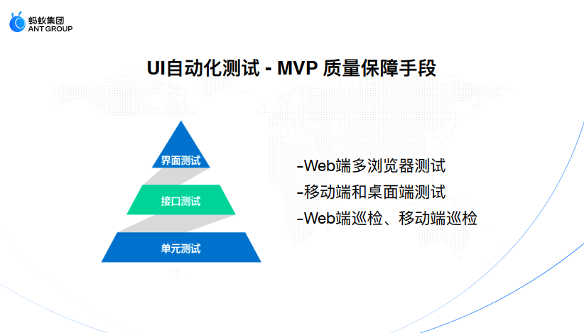
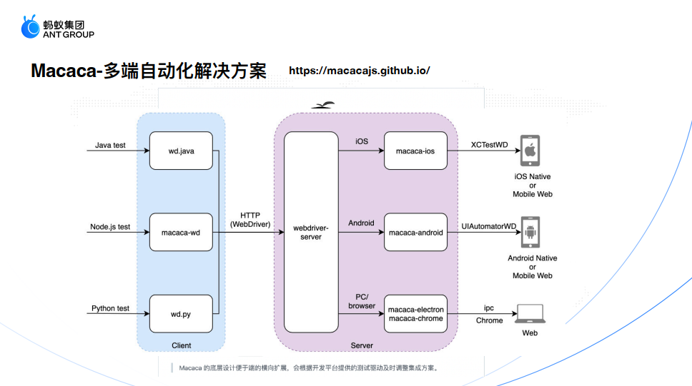
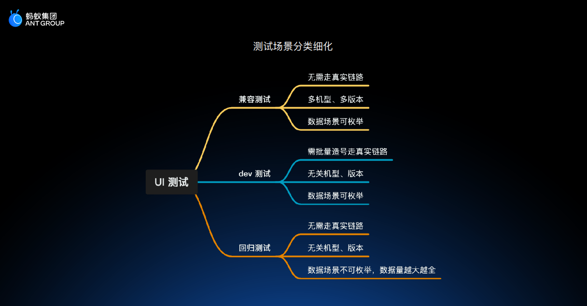
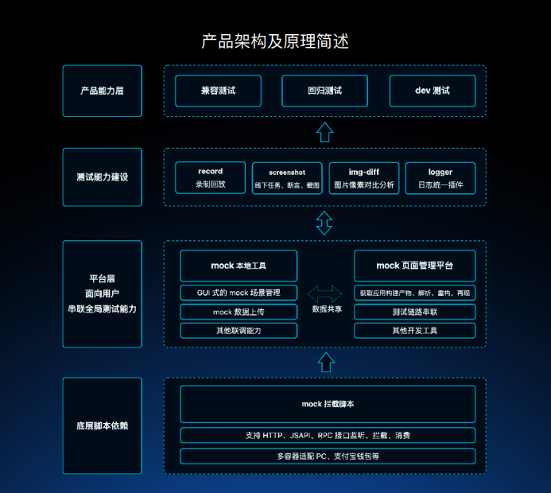
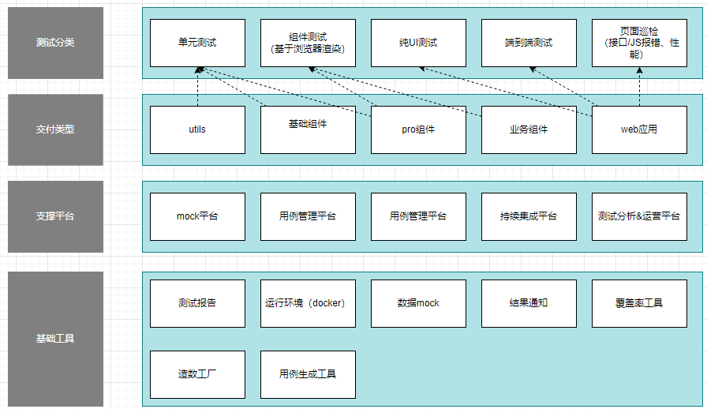
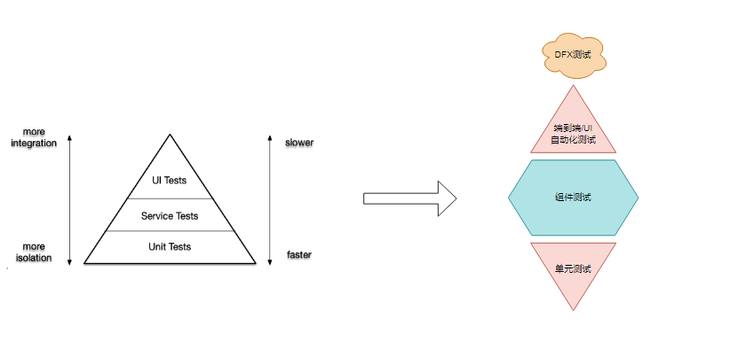
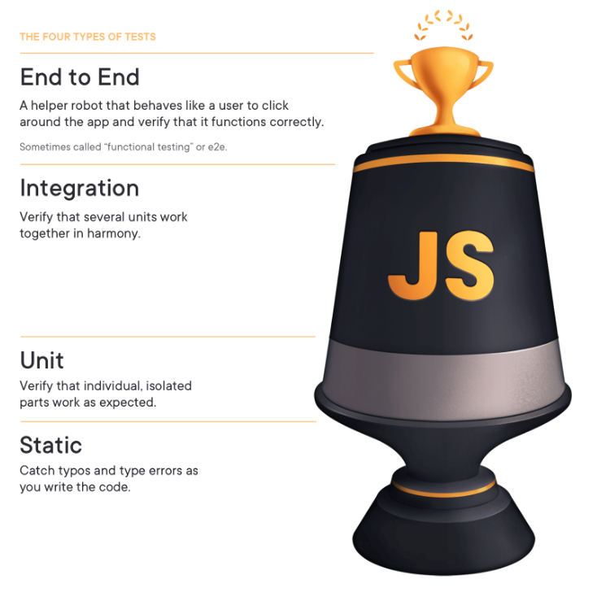
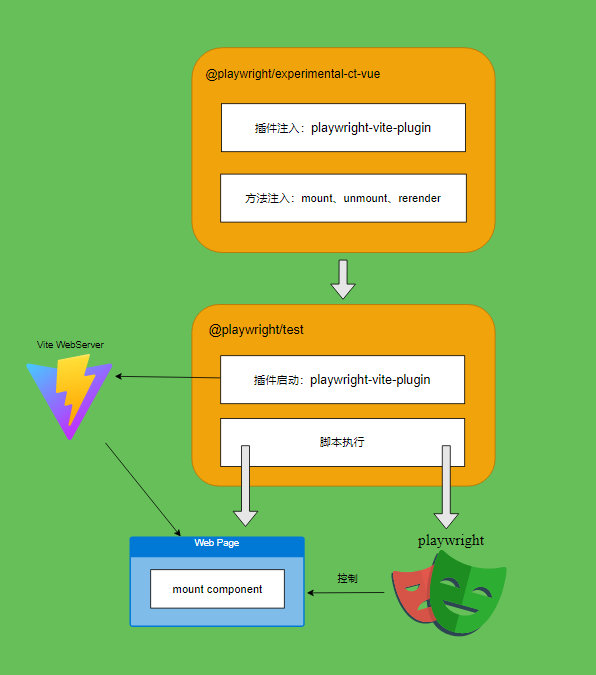
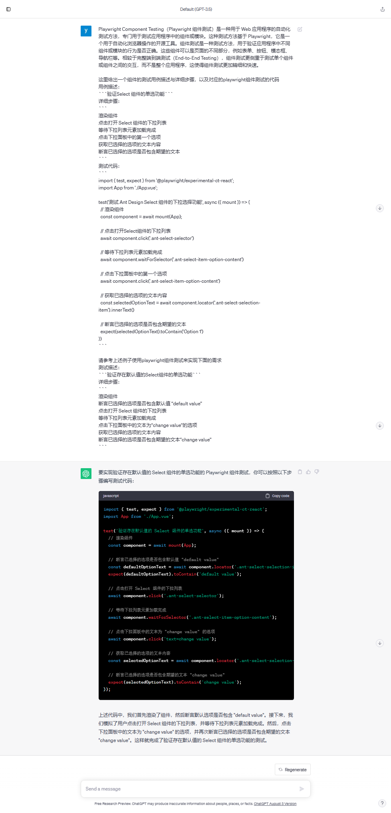

- [前端自动化测试技术规划](#前端自动化测试技术规划)
  - [洞察](#洞察)
    - [（看行业/趋势）行业技术变化趋势](#看行业趋势行业技术变化趋势)
    - [（看市场/客户）技术变化对客户的影响](#看市场客户技术变化对客户的影响)
    - [（看竞争）竞品分析技术思路和理念](#看竞争竞品分析技术思路和理念)
      - [语雀前端团队](#语雀前端团队)
      - [蚂蚁数金团队](#蚂蚁数金团队)
      - [融合 Ai 能力的自动化测试平台](#融合-ai-能力的自动化测试平台)
    - [(看机会)新技术进展与机会](#看机会新技术进展与机会)
    - [（看自己）技术差距与优势](#看自己技术差距与优势)
    - [洞察总结](#洞察总结)
  - [规划](#规划)
    - [技术目标](#技术目标)
    - [技术设计总览](#技术设计总览)
    - [策略](#策略)
    - [关键技术-组件测试](#关键技术-组件测试)
    - [关键技术-lowcode 自动化测试](#关键技术-lowcode-自动化测试)
    - [关键技术-codeless 自动化测试](#关键技术-codeless-自动化测试)
    - [技术路标](#技术路标)

# 前端自动化测试技术规划

## 洞察

### （看行业/趋势）行业技术变化趋势

| 技术领域            | 技术发展趋势                                                                                                                                                                                                                                                                                                                                                                                                     | 对策                                                                                                                                                                                                                               |
| ------------------- | ---------------------------------------------------------------------------------------------------------------------------------------------------------------------------------------------------------------------------------------------------------------------------------------------------------------------------------------------------------------------------------------------------------------- | ---------------------------------------------------------------------------------------------------------------------------------------------------------------------------------------------------------------------------------- |
| 前端框架/库         | 随着 web 端应用的复杂度越来越高，各种库与框架层出不穷，且能力与可能性都在变强，越来越多的应用都趋向于使用 B/S 架构，部分 C/S 架构应用也会使用 web 的技术栈来开发。                                                                                                                                                                                                                                               | 团队内使用的框架基本统一 Vue2/Vue3,核心业务使用的组件也基本上是统一的几套，核心业务基本上是中后台 web 应用。                                                                                                                     |
| 单元测试            | 从 mocha 到 jest 再到 vitest，这些单测框架的功能，API 易用性、执行速度、集成成本都在不断的变好。如果你的 web 应用使用 vite 打包，使用 vitest 来作为你的单测框架可以为你省下非常多的配置工作，并且也有显著的执行速度优势。                                                                                                                                                                                        | 目前前端的单测大多数都只在 utils、基础组件库这样的库中，业务项目中受限于开发周期与人员能力少有能够把单测在业务代码中铺开。                                                                                                         |
| 组件测试            | 这里我们更多的讨论的是 cypress、playwright 这些端到端测试框架提供的 component testing 能力，将 ui 组件渲染到真实的浏览器中，然后对他们进行自动化测试，不仅能够测试到组件的功能，还能测试组件的样式与外观。                                                                                                                                                                                                       | 对于基础组件库我们大多会选择 jest 或 vitetest 这样的单测框架来做组件的自动化测试，component testing 也不失为一个好的选择，对于业务项目中的很多用基础组件二次封装的组件或者是业务组件，component testing 可能是更具有性价比的选择。 |
| E2E 测试            | playright 和 cypress 目前最热门的端到端测试框架，对比传统的端到端测试框架 Selenium 他们的能力、速度、易用性都有了很大的提升，对于各种复杂的现代 web 应用的自动化测试也能满足（vs code、outlook）。                                                                                                                                                                                                               | 除了工具的能力与易用性，业务端对选择测试框架时更多的还需要关注团队的组成与人员能力，比如自动化测试是开发人员来做开始测试人员做还是一起共建。                                                                                       |
| lowcode 自动化测试  | 主流的端到端测试框架都推出了通过录制生成可用的测试代码的工具或能力，如 Cypress Studio、Playwright Test generator、Selenium IDE，开发人员基于生成的代码在做调整后得出最后的测试脚本，可以快速完成基础的测试脚本开发工作。                                                                                                                                                                                         | 虽然可以通过录制来生成可用代码，但是一般我们的测试脚本都是经过封装过的，自动生成的代码往往是没有封装过的，改写为封装后的代码会需要花费额外的时间，直接使用不封装的话长期来看有缺少可维护性。                                       |
| codeless 自动化测试 | 通过录制与回放来完成整个自动化测试过程，可以极大的降低测试脚本的开发成本与人员能力要求，从各个自动化测试状态报告中可以看到目前越来越多的企业在尝试 codeless 自动化测试。市面上也有越来越多的 codeless 自动化测试产品推出，并且往往多结合了 AI 的能力具备一定的智能推断与用例自愈能力，运行在云端的 codeless 自动化测试产品能够快速提供大量的运行环境、并且测试分析面板可以为我们的度量分析提供非常好的参考作用。 | 这个领域目前做的比较好的大多数都是国外的产品，并且基本都是 saas 化的收费产品，从自研成本与难度建议优先考虑采购成熟产品。                                                                                                           |

### （看市场/客户）技术变化对客户的影响

| 角色     | 痛点                                                                                                                                                                                                                                                                           |
| -------- | ------------------------------------------------------------------------------------------------------------------------------------------------------------------------------------------------------------------------------------------------------------------------------ |
| 用户     | UI 的质量与稳定性直接影响了用户是否能够正常使用产品与使用体验的好坏                                                                                                                                                                                                            |
| 测试人员 | 产品的快速迭代会产出大量重复测试工作；随着敏捷开发模式的落地，迭代的交付周期越来越短，留给测试的时间也越来越短                                                                                                                                                                 |
| 开发人员 | 需求交付的周期越来越短，缺乏足够的时间来做详细的设计去保障编码的质量；拆分业务团队后开发团队以外的不属于的模块时很难依靠个人编码能力保障质量；存在大量的二次封装过的组件或业务组件缺少质量保障；需要有低成本可靠的质量保障手段来支持敏捷开发过程中的小范围重构来不断优化技术债 |

### （看竞争）竞品分析技术思路和理念

#### 语雀前端团队

通过 Macaca 解决方案来实现多端的界面测试

- 基于 WebDriver 不同的驱动程序（macaca-ios/android/electron/chrome）去支持我们的测试脚本跑在不同的环境中如浏览器、安卓或 ios 原生程序

- 通过 macaca-playwright 驱动程序来实现 web 端的多端测试（chrome/firefox/safari）
- 支持通过 uirecorder 进行用例录制与回放

整体都是对外开源的，从 github stars 和 issue 来看外部使用的并不多，且官方维护积极性也一般，更多的应该还是基本内部在使用，不过整个解决方案的思路是值得借鉴的

关注的技术领先点：

- 多端的界面测试
- 录制与回放能力

#### 蚂蚁数金团队

更多的关注的是 UI 渲染的准确性，通过 mock 来解决接口层的依赖， mock 相关的工具与平台建设做的相对比较完善

关注技术领先点：
mock 工具与平台

#### 融合 Ai 能力的自动化测试平台

- 智能检测 UI 渲染
- 智能识别元素定位
- 用例自愈
- 智能识别
  阿里：[淘宝如何做智能化 UI 测试？](https://developer.aliyun.com/article/809979)
  腾讯：[腾讯自动化测试的 AI 智能](https://cloud.tencent.com/developer/article/1354843)
  网易：[智能 UI 自动化测试解决方案](https://dun.163.com/news/p/0dd470ce9a254ee9ae2287c21d675089)
  京东：[智能测试实践之路 - UI 缺陷检测](https://developer.jdcloud.com/article/2829)

关注技术领先点：

- UI 自动化测试+AI

### (看机会)新技术进展与机会

| 宏观机会点                                                                                     | 分析与对策                                                                                                        |
| ---------------------------------------------------------------------------------------------- | ----------------------------------------------------------------------------------------------------------------- |
| Xaas 化、敏捷转型、测试变革                                                                    | 面对快速的产品迭代必须要有可持续且具有性价比的质量保障手段，自动化测试是其中必不可少的一个环节                    |
| 越来越多的企业开始尝试 codeless 自动化测试，各种 codeless 自动化工具或产品也在不断地推出或完善 | codeless 自动化测试可以很好的减少传统的 UI 自动化测试中人员能力与成本投入的问题                                   |
| AI 的蓬勃发展                                                                                  | 通过 AI 去快速生成测试脚本，或者通过 AI 减少 codeless 自动化测试中的识别准确度、定位难、UI 变更带来的重新录制问题 |

### （看自己）技术差距与优势

| 能力维度                 | 差距                                                                                                                    |
| ------------------------ | ----------------------------------------------------------------------------------------------------------------------- |
| 自动化测试分层           | 前端基本没有测试分层的概念，只有部分极少部分项目有单测                                                                      |
| 端到端/UI自动化测试 | 少有前端团队有投入这方面，部分测试团队有建设                                                                            |
| 组件测试                 | 基于浏览器渲染的组件测试目前还是比较新的一个能力，业界目前还没有看到太多的实践                                          |
| lowcode 自动化测试       | 热门的开源测试框架都有对于的代码生成工具，如 cypress studio、Playwright Codegen、selenium idea 等，不太建议自研基础工具 |
| codeless 自动化测试      | 各大厂基本都有自己的 codeless 自动化测试方案，我们暂无相关经验，自研成本过高，且效果不一定好                            |

### 洞察总结

从产品模式（Xaas 化）与研发模式转型（敏捷）上来看，产品质量与稳定性的要求越来越高，研发的质量保障举措也要跟上要求。

行业关于自动化测试的技术也在不断地发展成熟，有了很多能力更强更易用的工具能够帮助我们更好的去建设自动化测试。

codeless + AI 自动化测试 让各种 codeless 自动化测试产品的能力变得跟强了，这类工具可以显著的减少投入成本与人员能力要求，团队可以选择自研或者直接购买成熟的服务
在各大厂核心产品的质量保障手段中自动化测试是非常重要的一个环节，并且在不断地迭代优化来平衡投入产出比。

ToC 与 ToB 的产品特点不一样，比如好多 ToC 产品的自动化测试只关注到 UI 的渲染是否正常，但对于 ToB 的产品可能检查到这个程度是完全不够的，可能会更加关注用户的操作是否得到预期的结果（包括数据层面）。

对于我们来说，我们需要借鉴别人的建设思路，选择适合自己的自动化测试分层模型来建设。

## 规划

### 技术目标

通过合理的前端自动化测试分层建设来保障业务的快速高质量交付

### 技术设计总览

### 策略

以编码过程中时效性最高的静态扫描为基础、覆盖公共库的单元测试、组件测试作为 web 应用自动化测试的核心、少量端到端激自动化来构建整个前端自动化测试体系

### 关键技术-组件测试

基于浏览器渲染的组件测试目前还是一个比较新的技术，目前是实验性的特性，且社区中看到的案例还比较少。

详细介绍可以见[component-testing](../component-testing/component-testing.md)

在组件化开发 web 应用的时代，划分出应用核心组件资产，不仅限于业务组件、pro 组件，组件的粒度甚至可以扩大到模块，这部分复用最多的组件通过自动化测试保障好组件自身的质量，并且基本不存在外部依赖，测试的稳定性与维护成本最优。

### 关键技术-lowcode 自动化测试

对于使用 Playwright、Cypress 等配套代码工具来实现 lowcode 的场景我们不做过多的分析，这里更多的讨论基于 AI 大模型技术生成代码的场景。

对于组件测试和端到端测试这种模拟用户行为的脚本，代码的重复性和通用性比普通的代码要高不少，通过描述测试需求让大语言模型来生成目标代码的可以为我们开发测试脚本省去非常多的时间，但是如果要不断地提高大语言模型输出代码的准确性与完成度需要我们不断地探索更好的提示词、知识库或是自己来训练模型。

基于通用大语言模型的代码生成（GPT-3.5）

上述代码的完成度已经非常高了，大幅度减少了测试脚本的开发时间。

### 关键技术-codeless 自动化测试

虽然可以大幅度减少 UI 自动化测试的投入成本，但是建立成熟的功能或平台能力的研发投入也不低、时间周期也比较长，更合适的做法可能是采购外部成熟产品。

### 技术路标

建议的技术发展/落地路线：

阶段一：
静态扫描
E2E 自动化测试（少量）

阶段二：
组件测试
codelessUI 自动化测试

阶段三：
lowcode 自动化测试
